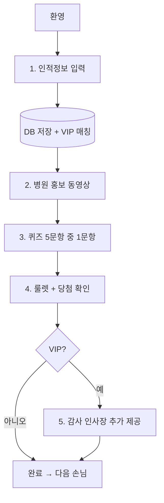

# 🎰 부스 경품 룰렛

> `booth_roulette.html` 프로토타입을 [KOIHA-NTRH](https://github.com/29zoo/KOIHA-NTRH) 스택(Vite + React + Tailwind / Fastify + Prisma)으로 변환한 이벤트 웹앱입니다.

## 스택

| 영역 | 기술 |
|------|------|
| 클라이언트 | Vite 8, React 19, TypeScript, Tailwind CSS 4 |
| 서버 | Fastify 5, TypeScript, Prisma (PostgreSQL) |
| 기타 | xlsx (VIP 엑셀) |

## 참가 흐름 (5단계)



### 1단계 — 인적정보
- 이름, 소속기관, 직종(의사·간호사·응급구조사·치료사·행정·학생·기타), 전화번호
- `POST /api/booth/register` → DB 저장 + VIP 명단 매칭
- 전화번호 기준 1인 1회 참여

### 2단계 — 홍보 동영상
- **관리자 화면** → 🎬 홍보 영상 → MP4/WebM/MOV 업로드 (서버 저장)
- 최소 10초 시청 후 다음 단계

### 3단계 — 퀴즈
- 5문항 중 1문항 랜덤 출제 (`client/src/lib/quiz.ts`)
- 정답/오답 관계없이 룰렛 진행 (결과 DB 저장)

### 4단계 — 룰렛
- 잔여 재고 비례 가중치 추첨
- 당첨 모달 + 색종이

### 5단계 — VIP 감사 인사 (VIP만)
- 감사 인사장 화면 추가 표시 → 운영자 인쇄물 전달 안내

## 빠른 시작

```powershell
cd "d:\Cliva RC\Promotion\booth-roulette"

# 의존성 설치
npm install

# server/.env · client/.env 생성 (각 .env.example 참고)
copy server\.env.example server\.env
copy client\.env.example client\.env

# DB 마이그레이션
npm run db:migrate

# 개발 서버 (API :4000, 클라이언트 :5180)
npm run dev
```

브라우저: http://localhost:5180

## 주요 기능

- 📝 인적정보 입력 (이름·소속·직종·전화) + DB 저장
- ⭐ VIP 명단 자동 매칭
- 🎬 병원 홍보 동영상
- ❓ 퀴즈 5문항 중 1문항 랜덤
- 🎰 잔여 재고 비례 룰렛
- 💌 VIP 감사 인사장 추가 제공
- 📦 재고·참가자 관리, CSV 내보내기

## 프로덕션 빌드

```powershell
npm run build
cd server
npm start
```

빌드된 클라이언트(`client/dist`)는 Fastify가 정적 파일로 서빙합니다.

## 원본 HTML

루트의 `booth_roulette.html`은 단일 파일 프로토타입이며, 본 프로젝트가 그 기능을 모노레포로 이식한 버전입니다.

## API

| Method | Path | 설명 |
|--------|------|------|
| GET | `/api/health` | 헬스체크 |
| GET | `/api/booth/state` | 재고·VIP·참가자 조회 |
| PUT | `/api/booth/state` | 상태 일괄 저장 (관리자) |
| POST | `/api/booth/register` | 1단계 인적정보 등록 + VIP 매칭 |
| PATCH | `/api/booth/participants/:id/quiz` | 3단계 퀴즈 결과 |
| PATCH | `/api/booth/participants/:id/prize` | 4단계 당첨 + 재고 차감 |
